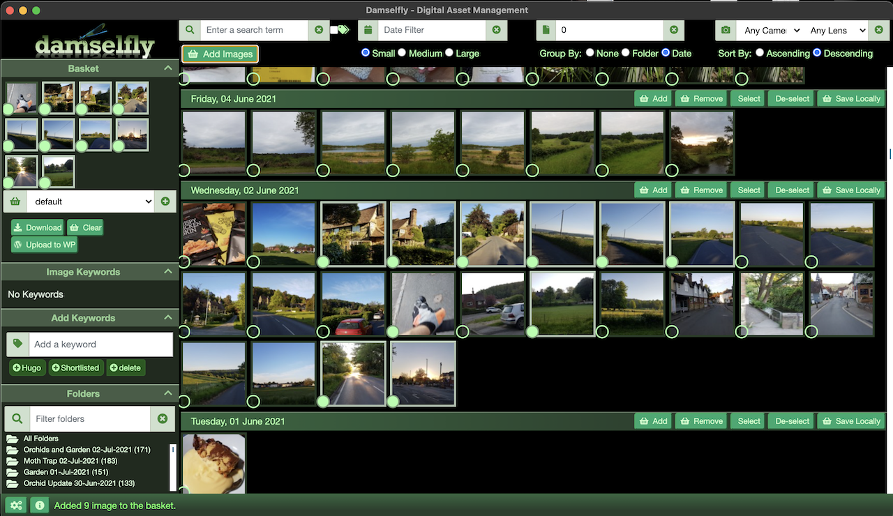
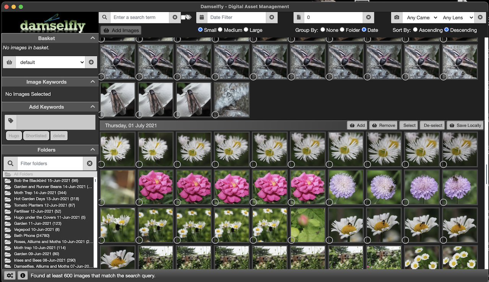

# Damselfly
Damselfly is a server-based Digital Asset Management system. The goal of Damselfly is to index an extremely large collection of images, and allow easy search and retrieval of those images, using metadata such as the IPTC keyword tags, as well as the folder and file names. 





## Features

* Server-based deployment, with a web UI, so the image library can be accessed via multiple devices without having to copy catalogues or other DBs to local device storage. 
* Focus on extremely fast performance - searching a 500,000-image catalogue returns results in around a second.
* Full-text search with multi-phrase partial-word searches
* Fast keyword tagging workflow addition, with non-destructive tagging (JPEG images are not re-encoded)
* Background indexing of images, so that the collection is automatically and quickly updated when new images are added or updated
* Background thumbnail generation
* Synology DSM/Photos compatibility mode to re-use exiting thumbnails generated by the indexing process
* Selection basket for collecting images from search results to save locally and work within Digikam/PhotoShop/etc.
* Download/export processing to watermark images ready for social media, or sending via Email etc.
* Runs on Windows, Linux and OSX, and in Docker.
* Electron.Net Desktop Client for hosted site to allow closer native integration with client OS
 * Synchronise images from server basket select to local filesystem for editing
 * Other integrations coming in future
* Direct upload to Wordpress 
* Persistable named basket selections

## Planned Features/Enhancements

* Direct upload to CMS platforms
* Direct sharing to social media (Twitter, Facebook etc)
* Support for selection and upload to Alamy Stock Image photo service
* Simple non-destructive editing/manipulation - cropping, colour adjustment etc
* Synchronisation of local images to the server
* If you have ideas for other features - let me know by raising an issue!

---
## Installation

The easiest way to install Damselfly is via Docker.

```
docker run \
  --name damselfly \
  --restart unless-stopped \
  -v /volume1/dockerdata/damselfly:/config \
  -v /volume1/photo:/pictures \
  -e SYNO_THUMBS=true \
  -p 6363:6363 \
  -d \
  webreaper/damselfly
```

The default port is 6363. The /pictures volume is mapped to the root directory of your photographs. By 

Note that in order to set up inotify watchers on your folders, Damselfly will increase the number of inotify instances as follows:

```
echo fs.inotify.max_user_instances=524288 | sudo tee -a /etc/sysctl.conf && sudo sysctl -p
```

Other options:
`SYNO_THUMBS=True` - Tells Damselfly to use existing Synology thumbnails (which are generated by DSM's indexing process) and to generate new thumbs in the same format.

---

## How does Damselfly Work?

A lot of the UI/UX paradigms within Damselfly are based on the same sorts of functionality found in Google's highly popular, but now-defunct
Picasa application. I've used Picasa for over a decade, and the speed and simplicity of its management of photos, particularly around search,
simple edits, and keyword tagging/management, are unmatched anywhere else in my opinion. Unfortunately, Google decided to demise Picasa, and 
whilst it still works, it's becoming less and less practical to use (e.g., on MacOS, it runs on Catalina/Big Sur, but can't be installed because
the installer is 32-bit). So I've borrowed some of the concepts for Damselfly:

* Basket selection - images within Dasmselfly can be added to the basket by clicking the round button on each thumb. 
* Once in the basket, certain operations can be carried out, such as uploading to Wordpress in a single click, or exporting at various resolutions,
with or without a watermark.
* There's also a selection model, for quick operations on a few images in the browse screen. Click to toggle selection, and then add keywords, or
add to the baskey, using the buttons at the bottom of the browse area. Note: the selection model needs some improvements to support shift-select,
etc - these will be coming.
* Adding keywords (IPTC tags) can be done for selected images, images in the basket or the currently displayed image on the properties screen.

### How does Damselfly index images?

At startup, Damselfly will run a full index on the folder of images passed in as the only mandatory parameter (or the volume mapped to /pictures 
if you're running in Docker). The process runs as follows:

1. Damselfly will scan the entire folder tree for any images (currently JPEG, PNG, etc; HEIC and others will be added when Google's image processing
library Skia supports them). This process is normally very quick - on my Synology NAS, around half a million images can be scanned in an hour or two).
During this process, a filesystem iNotify watcher will be set up for each folder in the tree to watch for changes.
2. Next, Damselfly will then go back through all of the images, in newest (by file-modified-date) order first, and run the metadata scan. This is 
more time-consuming, but will pull in all of the metadata such as the resolution, keyword tags, other EXIF data, when the photo was taken, etc.
3. Lastly, the thumbnail generation process will run - generating the small previews used when browsing. This process is CPU-intensive, and can take
some time; for my 4TB+ collection of half a million photos, it'll take 5+ days to run on my Synology NAS - processing around 100 images per minute.
It'll also nail the CPU while it runs, so be aware of that. 

Once step #2 finishes, the first full-index is complete. From that point onwards, changes to the image library should be picked up almost instantly
and processed quickly; adding a new folder of photos after a day out should only take a minute or two. 

### How should we use Damselfly? What's the workflow?

Workflow is a little like distributed software development using Git. Photo manipulation is done locally, but then the images can be pushed to the remote server for integration into the main collection, and deleted from local storage. When you want to edit specific photos you can search and export/download them back to your local work area.

### Suggested workflow.

1. Images are copied onto a laptop for initial sorting, quality checks, and IPTC tagging using Picasa or Digikam
2. [Rclone](www.rclone.org) script syncs the new images across the LAN to the network share
3. Damselfly automatically picks up the new images and indexes them (and generates thumbnails) within 30 minutes
4. Images are now searchable in Damselfly and can be added to the Damselfly 'basket' with a single click
5. Images in the basket can be copied back to the desktop/laptop for local editing in Lightroom/On1/Digikam/etc.
   * Use the Damselfly Desktop client to write the files directly to the local filesystem in the same structure as on the server.
   * Export to a zip file to download and extract into the local image folder for additional editing
6. Re-sync using RClone to push the images back to the collection [Future enhancement: Damselfly Desktop App will do this for you]

---

## Background/FAQ

Some common questions/answers.

### Do I have to run it in Docker?

No, you can run it standalone. For the first beta release, I'm only making Docker available, but I'll soon make binaries available for Windows and MacOS.

### Why 'Damselfly'?

Etymology of the name: DAM-_sel_-fly - **D**igital **A**sset **M**anagement that flies.

### What is the Damselfly Architecture?

Damselfly is written using C#/.Net Core and Blazor Server. The data model and DB access is using Entity Framework Core. Currently the server supports Sqlite, but a future enhancement may be to add support for PostGres, MySql or MariaDB.

### How do I set up the Wordpress Integration?

Damselfly allows direct uploads of photographs to the media library of a Wordpress Blog. To enable this feature, you must configure your Wordpress site to support JWT authentication. For more details see [JWT Authentication for WP REST API](https://wordpress.org/plugins/jwt-authentication-for-wp-rest-api/).

To enable this option you’ll need to edit your .htaccess file adding the following:

    RewriteEngine on
    RewriteCond %{HTTP:Authorization} ^(.*)
    RewriteRule ^(.*) - [E=HTTP_AUTHORIZATION:%1]
    SetEnvIf Authorization "(.*)" HTTP_AUTHORIZATION=$1
    
The JWT needs a secret key to sign the token this secret key must be unique and never revealed. To add the secret key edit your wp-config.php file and add a new constant called JWT_AUTH_SECRET_KEY

    define('JWT_AUTH_SECRET_KEY', 'your-top-secret-key');

To enable the CORs Support edit your wp-config.php file and add a new constant called JWT_AUTH_CORS_ENABLE

    define('JWT_AUTH_CORS_ENABLE', true);

You can use a string from [here](https://api.wordpress.org/secret-key/1.1/salt/).

Once you have the site configured:

1. Install the [Wordpress JWT Authentication for WP REST API](https://wordpress.org/plugins/jwt-authentication-for-wp-rest-api/) plugin.
2. Use the config page in Damselfly to set the website URL, username and password. I recommend setting up a dedicated user account for Damselfly to use.

### Why did you build Damsefly?

I wrote Damselfly mainly to cater for a personal use-case, but decided to open-source it to make it available for others to use if it works for them. My wife is a horticultural writer and photographer ([pumpkinbeth.com](http://www.pumpkinbeth.com)) and over the years has accumulated a horticultural photography library with more than half a million pictures, in excess of 4.5TB of space. 

In order to find and retrieve photographs efficiently when writing about a particular subject, all of the photos are meticulously tagged with IPTC keywords describing the content and subject matter of each image. However, finding a digital asset management system that supports that volume of images is challenging. We've considered many software packages, and each has problems:

* Lightroom
  * Pro: Excellent keyword tagging support
  * Pro: Fast when used with local images
  * Con: Catalogues are not server-based, which means that images can only be searched from one laptop or device.
  * Con: Catalogue performance is terrible with more than about 50,000 images - which means multiple catalogues, or terrible performance
  * Con: Importing new images across the LAN (when the catalogue is based on a NAS or similar) is slow.
  * Con: Imports are not incremental by date, which means that to add new photos, the entire 3TB collection must be read across the LAN
  * Con: Lightroom 6 is 32-bit only, so not supported on OSX Catalina
* Picasa
  * Pro: Simple UI and workflow
  * Pro: Very fast and efficient IPTC keyword tagging
  * Con: Doesn't support network shares properly
  * Con: Can't handle more than about 15,000 images before it starts to behave erratically
  * Con: No longer supported by Google, and 32-bit only, so no OSX Catalina support
* ON1 RAW
  * Pro: Simple UI and workflow
  * Pro: Fast cataloging/indexing of local photos
  * Pro: Not too expensive
  * Con: Slow to index across a network share
* FileRun
  * Pro: Great search support
  * Con: Really designed for documents, rather than specifically for image management
  * Con: Can support server-side indexing and shared multi-device catalogues - but Windows-only
* ACDSee
  * Pro: Fast, 
  * Con: The 'non-destructive' workflow is, actually, destructive, and can easily result in loss of images.
* Digikam
  * Pro: Free/OSS
  * Pro: Excellent for working with a local collection
  * Con: Performance is terrible for collections > 50k images, whether using Sqlite or MySql/MariaDB. 
  * Con: Startup takes > 10 minutes on OSX with 100k+ images.
* Google Photos 
  * Pro: Excellent for large collections
  * Pro: Image recognition technology can help with searching
  * Con: Search ignores IPTC tags
  * Con: Expensive for > 1TB storage
* Amazon Cloud Drive
  * Pro: Excellent for large collections
  * Pro: Unlimited Storage of images included free with Prime
  * Pro: Image recognition technology can help with searching
  * Con: Search ignores IPTC tags
  * Con: Only supports Amazon's native apps. No support for _any_ third party clients.

--- 

## Contributing to Damselfly

I am a professional developer, but Damselfly is a side-project, written in my spare time. I'm also not a web designer or CSS expert (by any means). If you'd like to contribute to Damselfly with features, enhancements, or with some proper shiny design/layout enhancements, please submit a PR!

## Thanks and Credits

* Microsoft [Blazor.Net](https://blazor.net)
* [SkiaSharp](https://github.com/mono/SkiaSharp) Fast library for Thumbnail generation
* [SixLabors ImageSharp](https://github.com/SixLabors/ImageSharp) Portable library for Thumbnail generation
* Drew Noakes' [MetadataExtractor](https://github.com/drewnoakes/metadata-extractor-dotnet), for IPTC and other image meta-data indexing
* IPTC Tag management using [ExifTool](https://exiftool.org/)
* Icons by [Font Awesome](https://fontawesome.com/)
* Chris Sainty for [Blazored](https://github.com/Blazored) Modal and Typeahead, and all his excellent info on Blazor
* [Serilog.Net](https://serilog.net/) for logging
* Wisne for [Infinite Scroll](https://github.com/wisne/InfiniteScroll-BlazorServer) inspiration
