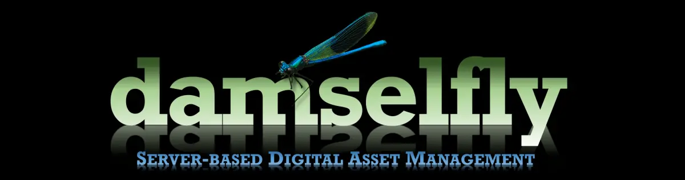
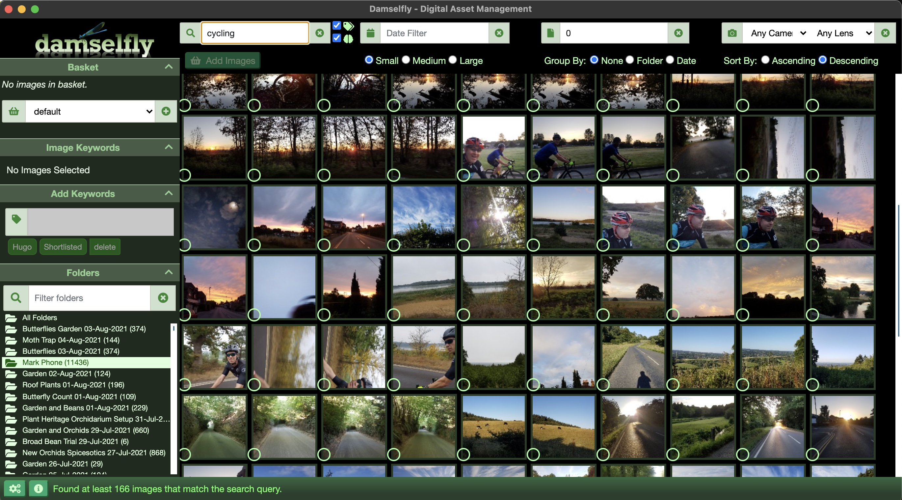
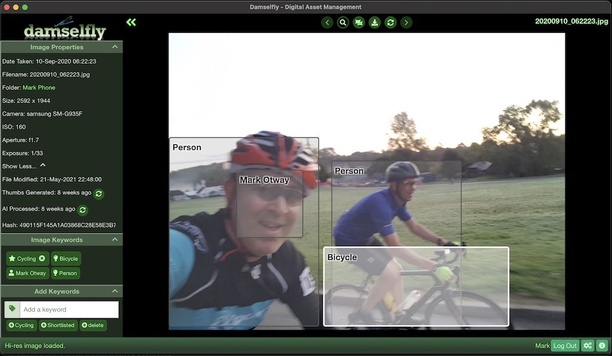
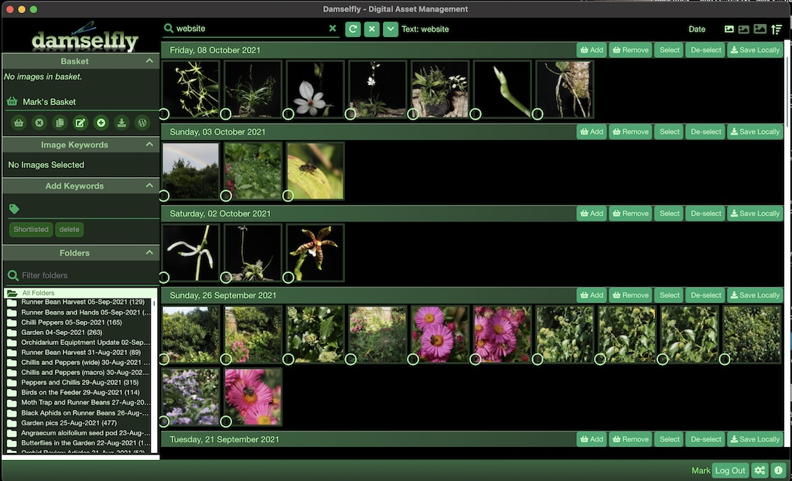

# Damselfly - A Photo Management System

Damselfly is a server-based Digital Photograph Management system. Damselfly is designed to manage a large, folder-based 
collection of photographs, with a particular focus on fast search and keyword-tagging workflow.

Damselfly includes powerful Machine Learning functions which can help you identify photographs and their subjects, including
face detection, object detection, and (with an optional Azure Face Services account) full facial recognition - allowing you 
to tag people once, and have Damselfly identify other photos in which they appear.

The user-interface and workflow is loosely based on the much-loved Google Picasa app, with a basket to select images for 
export and other types of processing. Damselfly also provides a desktop/client app which gives closer integraton with your 
laptop or PC, allowing you to quickly sync a selection of images from the Damselfly basket to a local folder, for 
editing etc.

## Features

* Support for most image formats including JPG, PNG, HEIC, TIFF, Webp, BMP and DNG/CR2/ORF (RAW) files.
* AI / Computer vision image recognition:
    * Facial detection
    * Object detection and recognition
    * Image Classification
    * Facial Recognition (requires a [free Azure Face Services account](https://azure.microsoft.com/free/cognitive-services/))
* Full-text search with multi-phrase partial-word searches
* Advanced search - filter by:
  * Find visually similar images
  * Date ranges
  * Objects/Faces/Identified faces
  * Camera/Lens Make/Model
  * File Size
  * Orientation
  * Images with no keyword tags

* Focus on extremely fast performance - searching a 500,000-image catalogue returns results in less than a second.
* Fast keyword tagging workflow with non-destructive EXIF data updates (using ExifTool) - so JPEGs are not re-encoded 
  when keyword-tagged
* [Multi-user support with user accounts](./docs/Multi-user.md), and role-based entitlements (e.g., users with ReadOnly 
  role are prevented from keyword-tagging images)
* Download/export processing to watermark images ready for social media, or sending via Email etc.
* Selection basket for saving images from search results:
    * Images within the basket can be downloaded, exported for use within Digikam/PhotoShop/etc., or 
      uploaded to Wordpress
    * Baskets can be user-specific, or shared with other users
* Server-based deployment, with a web-based front-end UI, so the image library can be accessed via multiple 
  devices without having to copy catalogues or other DBs to local device storage.   
* Exclude images from Damselfly scanning by adding a `.nomedia` file in any folder.
* Themes
* Completely automated background indexing of images, so that the collection is automatically and quickly updated 
  when new images are added or updated
* Background thumbnail generation
* Electron.Net Desktop Client for hosted site to allow closer native integration with client OS
    * Desktop Client versions for MacOS (universal), Windows and Linux 
    * Synchronise images from server basket select to local filesystem for editing
    * Other integrations coming in future
* Runs on Windows, Linux and OSX, and in Docker.
* Built with Microsoft .Net 6, Blazor Server and EFCore 6. 

## Want to Support Damselfly?

Damselfly is free, open-source software. But if you find it useful, and fancy buying me a coffee or a slice of pizza, that would 
be appreciated!

# Getting in Touch
   
You can follow Damselfly on [Twitter](https://twitter.com/damselflyphotos) or ask questions/get support on Reddit ([r/DamselflyPhotos](https://reddit.com/r/damselflyphotos)). If you have problems, feature requests or have found a bug, you can [raise an issue](https://github.com/Webreaper/Damselfly/issues). Or if you want to say hello, [email me](mailto:info@damselfly.info).

## Screenshots

 
 

 

## Planned Features/Enhancements

* Image de-duplication (in progress)
* Direct upload to Social media platforms, Google Drive, etc.
* Support for more image formats, and possibly video
* Direct sharing to social media (Twitter, Facebook etc)
* Support for selection and upload to Alamy Stock Image photo service
* Simple non-destructive editing/manipulation - cropping, colour adjustment etc
* Synchronisation of local images back to the server
* If you have ideas for other features - let me know by [raising an issue](https://github.com/Webreaper/Damselfly/issues)!

# How should I use Damselfly? What's the workflow?

The photos live in the library on the server, but whenever you want to work on a picture (e.g., in Photoshop, Digikam or your editing tool of 
choice) you use the Damselfly Deskop app to add the images to the basket, and choose Download => Save Locally, to sync the pictures across 
the network to your local folder. Once you've finished editing, copy them back to the server (a future feature enhancement will let Damselfly 
do this for you) where the server will re-index them to pick up your changes.

### Suggested workflow.

1. Images are copied onto a laptop for initial sorting, quality checks, and IPTC tagging using Picasa or Digikam
2. [Rclone](https://rclone.org/) script syncs the new images across the LAN to the network share
3. Damselfly automatically picks up the new images and indexes them (and generates thumbnails) within 30 minutes
4. Images are now searchable in Damselfly and can be added to the Damselfly 'basket' with a single click
5. Images in the basket can be copied back to the desktop/laptop for local editing in Lightroom/On1/Digikam/etc.
   * Use the Damselfly Desktop client to write the files directly to the local filesystem in the same structure as on the server.
   * Export to a zip file to download and extract into the local image folder for additional editing
6. Re-sync using RClone to push the images back to the collection [Future enhancement: Damselfly Desktop App will do this for you]

## More information

* [Installation](./docs/Installation.md)
* [Multi-User and Roles](./docs/Multi-user.md)
* [Technical Background](./docs/Technical.md)
* [FAQ](./docs/FAQ.md)
* [Contributing to Damselfly](./docs/Contributing.md)

## Thanks and Credits

* Microsoft [Blazor.Net](https://blazor.net) for allowing me to avoid writing Javascript. ;)
* [PumpkinBeth](https://pumpkinbeth.com) (my wife) for taking the photo that appears in Damselfly's logo, and for providing the original
  inspiration to build Damselfly - as well as the 600,000 photos and counting which make excellent test data!
* [SkiaSharp](https://github.com/mono/SkiaSharp) Fast library for Thumbnail generation
* [SixLabors ImageSharp](https://github.com/SixLabors/ImageSharp) Portable library for Thumbnail generation
* Drew Noakes' [MetadataExtractor](https://github.com/drewnoakes/metadata-extractor-dotnet), for IPTC and other image meta-data indexing
* Phil Harvey's [ExifTool](https://exiftool.org/) which Damselfly uses for all of the EXIF write operations
* ZZZ Project's [Entity Framework Extensions](https://entityframework-extensions.net) for their excellent EFCore extensions.
* [MudBlazor](https://mudblazor.com/) for their excellent Blazor component library
* [EmguCV](https://www.emgu.com) for their Face and Object detection Haar classifier models
* [Azure Cognitive Services](https://azure.microsoft.com/en-gb/services/cognitive-services/face/) for their Face-recognition engine
* [Accord.Net](http://accord-framework.net) for additional Face recognition libraries
* [Font Awesome](https://fontawesome.com/) for their Awesome icons
* Chris Sainty for [Blazored](https://github.com/Blazored) Modal and Typeahead, and all his excellent info on Blazor
* [Serilog.Net](https://serilog.net/) for logging
* Wisne for [Infinite Scroll](https://github.com/wisne/InfiniteScroll-BlazorServer) inspiration 
