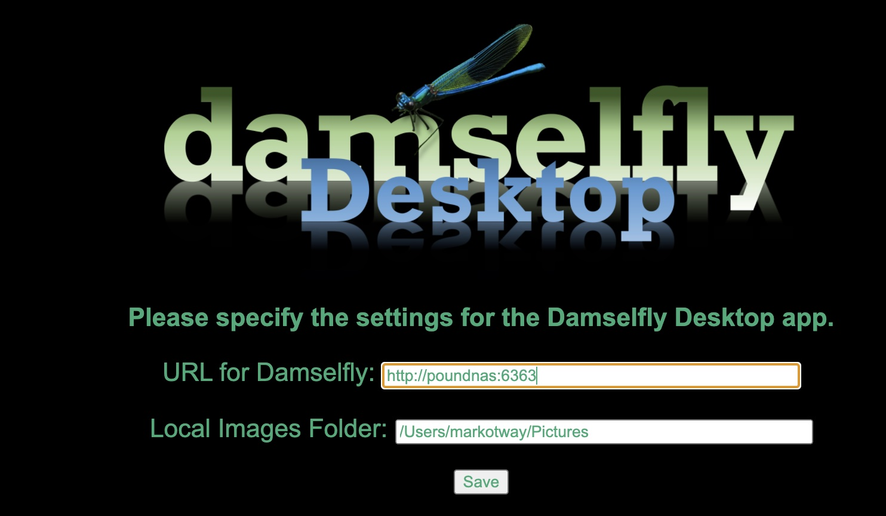

# Installing Damselfly

[Return to Readme](../README.md)

- [Installing Damselfly](#installing-damselfly)
  - [Docker](#docker)
    - [Docker Command:](#docker-command)
    - [Docker-Compose:](#docker-compose)
  - [FileWatcher INotify Limits](#filewatcher-inotify-limits)
  - [Setting up the Desktop Client](#setting-up-the-desktop-client)
    - [Installing the Desktop Client](#installing-the-desktop-client)
  - [Can I Run Damselfly Without Docker?](#can-i-run-damselfly-without-docker)
    - [Dependencies for Damselfly without Docker](#dependencies-for-damselfly-without-docker)

## Docker

The easiest way to install Damselfly is via Docker. Mount your photos folder as the /pictures volume, and a config 
folder (in which the database, thumbnails etc will be stored), and you're ready to go.

### Docker Command:
```
docker run \
  --name damselfly \
  --restart unless-stopped \
  -v /volume1/dockerdata/damselfly:/config \
  -v /volume1/photo:/pictures \
  -v /volume1/dockerdata/damselfly/thumbs:/thumbs \
  -p 6363:6363 \
  -d \
  webreaper/damselfly
```

**_Note:_** If you're running on a Synology NAS, and have the Synology indexing/thumbnails enabled, you can specify `-e SYNO_THUMBS=true` which will make Damselfly use the same `@eaDir` folder structure as Synology's indexing system, which means that thumbnails already generated will be used by Damselfly (and Damselfly's thumbnails will be used by Synology Photo Station).

### Docker-Compose: 
```
 damselfly: 
        container_name: damselfly
        image: webreaper/damselfly
        ports:
            - 6363:6363/tcp
        volumes:
            - /volume1/dockerdata/damselfly:/config
            - /volume1/dockerdata/damselfly/thumbs:/thumbs
            - /volume1/photo:/pictures 
        restart: unless-stopped
```

The default port is 6363, so unless you've changed that, once the server is up and running you can go http://ip.address.of.server:6363 to access the Web UI. The /pictures volume is mapped to the root directory of your photographs. 

Other options:
`SYNO_THUMBS=True` - Tells Damselfly to use existing Synology thumbnails (which are generated by DSM's indexing process) and to generate new thumbs in the same format.

## FileWatcher INotify Limits

Damselfly uses OS-level filewatcher triggers to monitor your library for changes. One watcher is created for each folder in your
photo library. 

For MacOS and Linus, the number of inotify watchers availalbe to the OS may be set very low (a few hundred) so you may need to increase 
the number of inotify instances as follows (where 524288 is any large number that's big enough for one watcher per folder), 
[for linux](https://unix.stackexchange.com/questions/13751/kernel-inotify-watch-limit-reached).

```
echo fs.inotify.max_user_instances=524288 | sudo tee -a /etc/sysctl.conf && sudo sysctl -p
```
The equivalent [for MacOS](https://superuser.com/questions/630777/how-do-i-configure-fsnotifys-queue-size-watch-limit-on-osx) is:
```
sudo sysctl -w kern.maxfiles=524288
```
Future versions of Damselfly will hopefully include this configuration within the docker image, so it's changed automatically.

## Setting up the Desktop Client

The Damselfly Desktop Client gives closer integration between the server and your Mac, Windows or Linux desktop. You can set up a local folder to mirror the 
folder structure of the photos on the server, and then use Damselfly Desktop to bring across images from the server to work on locally. So you might have
the server indexing:

     `/volume1/photos/Christmas 2020'
     `/volume1/photos/Holiday 2021'
     `/volume1/photos/Fred Wedding'

and set up a folder on your Mac:

     `/Users/markotway/Pictures'

To work on images locally, add them to the basket in and click the download/export button. When running the Damselfly Desktop app, a new button will appear:
'Save Locally', which will copy all of the images selected in, say, the Christmas album into a folder `/Users/markotway/Pictures/Christmas 2020`. Once you've 
finished working on the pictures, you can sync them back to the server (a future version of Damselfly will do this for you).

### Installing the Desktop Client

You can download the desktop client from the server 'info' page (the `i` icon in the bottom right of the status bar). Once downloaded, install as appropriate
for your chosen OS (e.g., the Mac version unzips to a `.dmg` file, which you can double-click, and drag/drop the app into the `Applications` folder).

When you first run the desktop app, you'll be presented with the settings screen; input the URL of the server Web UI, and the root folder of where you'd like
photos to sync locally.



Once you've entered the correct details, click `Save` and the Web UI should be displayed. 

## Can I run Damselfly without Docker?

Damselfly can be run without docker, but it will be harder to set up the AI components. Please note: I cannot provide support for installations 
that don't use docker. This is for experts only.

Note that Damselfly is a 64-bit app, so you'll need at 64-bit OS in order to run it, whether or not you use Docker.

To run without docker, you'll need to download the appropriate server binaries from the release (something like `damselfly-server-linux-2.9.0.zip` 
or the Windows/Mac equivalent). Note that I don't produce non-docker binary assets with every release; if you need them for a release and they're 
not there, 
please email and ask.

Once you've downloaded the binaries, extract them into a folder, and from the command-line within that folder run Damselfly. There is only one
mandatory command-line parameter, which is the path to where your photo collection can be found, so something like:

```
./Damselfly.Web /path/to/my/photos
```

### Dependencies for Damselfly without Docker

**Note: I cannot support non-docker installations; there are too many variations across all the different OS flavours/types, and I simply don't 
have time. I recommend you run Damselfly in Docker.**

Damselfly relies on various dependencies being present for all functionality to work. These are bundled with the Docker image, but if you're running
outside docker you'll need to manage them yourself. 

Many of the depenendencies may be available on Windows already. On linux/OSX, you'll need to install these by hand, probably via a package manager.
Dependencies you will require are:
* Exiftool (used for keyword and other metadata write operations to images)
* Fonts (used for watermarking images on export)
* libgomp1 / libdgiplus / libc6-dev - for ML/ONNX functionality for object recognition
* Various dependencies for the EMGUCV AI libraries for face-recognition etc.

To see the full set of dependencies required by Damselfly, see the 
[Dockerfile for the base image](https://github.com/Webreaper/Damselfly-Base-Image/blob/main/Dockerfile).
