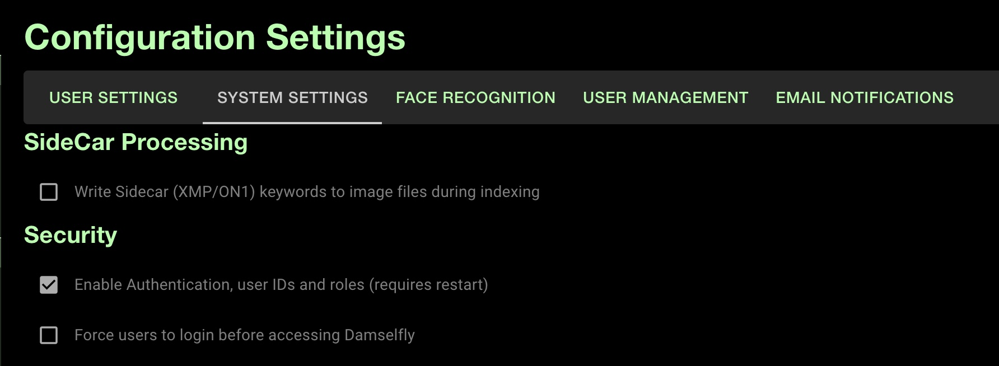
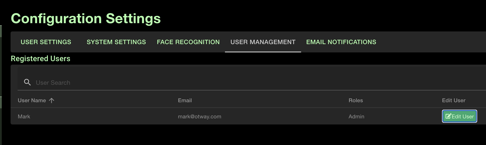

# Damselfly Multi-user, Roles and Entitlement Support

[Return to Readme](../README.md)

  - [Introduction](#introduction)
  - [User Accounts](#user-accounts)
  - [User Roles](#user-roles)
  - [Baskets](#baskets)

## Introduction

By default, Damselfly will allow anyone who can access it to browse, modify and download images via the web UI. Each browser session
will have its own state (selection, search results, etc., etc) but that will be discarded when the browser session ends. Additionally,
there's no control over who can download images, add keyword tags, and make other changes to images within the app. 

You can, however, enable user IDs, roles and entitlements by checking the 'Enable Authentication' checkbox in the 'System Settings'
tab of the Config page (which is accessed via the 'cogs' icon on the right-hand side of the status bar). 

This setting only takes effect
once the application has restarted, so once selected you'll need to shut down and restart the application (you can do this in Docker
by executing `sudo docker restart damselfly`).

When Damselfly restarts, you'll notice a couple of changes:
* There is a new 'Log In' button on the status bar
* The 'Add Keywords' section is missing from the sidebar

## User Accounts

The first time you run Damselfy with authentication enabled, you should create a default user account. Click 'Log In' and on the 
login page click 'Register an Account'. Enter your email and password, and you will be logged into Damselfly; you'll see your 
email displayed on the status bar. By default new users' Usernames are set to be their email addresses, but as an Admin user you
can change these to more meaningful names (e.g., 'Mark') via the Settings => User Management screen.

Once users are logged in, some of their actions will be recorded for auditing purposes. So for example, if a user adds a Keyword
to an image, their User ID will be associated with that operation - which means that it's possible to check why somebody added
an incorrect tag to an image (for example). 

> Note: User Audit reporting will be developed in a future release.

## User Roles

There are 3 different roles available in Damselfly:
* **User** - a standard user, who can browse, add keyword tags to images, and can download hi-res images from the server.
* **ReadOnly** - a user without permissions to make changes such as keyword tagging etc., and who does not have permission
  to download hi-res images from the server.
* **Admin** - an administrative user who has access to system settings, and who can manage other users in the system
  (including changing user roles, etc.).

There must always be at least one Admin user to manage the system, so the first registered user is automatically granted the 
'Admin' role. Also, if you attempt to change the last Admin user to another role, nothing will happen and the user will remain
in the Admin role. 

## Baskets

When authentication is disabled, baskets are available to anyone who uses Damselfly. This means that anyone can add/remove
images from any basket in the system.

Once authentication is enabled, private baskets can be associated with a user, or can be globally available (known as a 
'Shared Basket'). When a user first logs in, they will have a default private basket created called 'My Basket', only 
visible to them. This means that users can add/remove images from their own basket(s) without other users interfering with
them. Baskets can be made available to all users - click the 'Edit Basket' button and enable the 'Shared Basket' checkbox.
